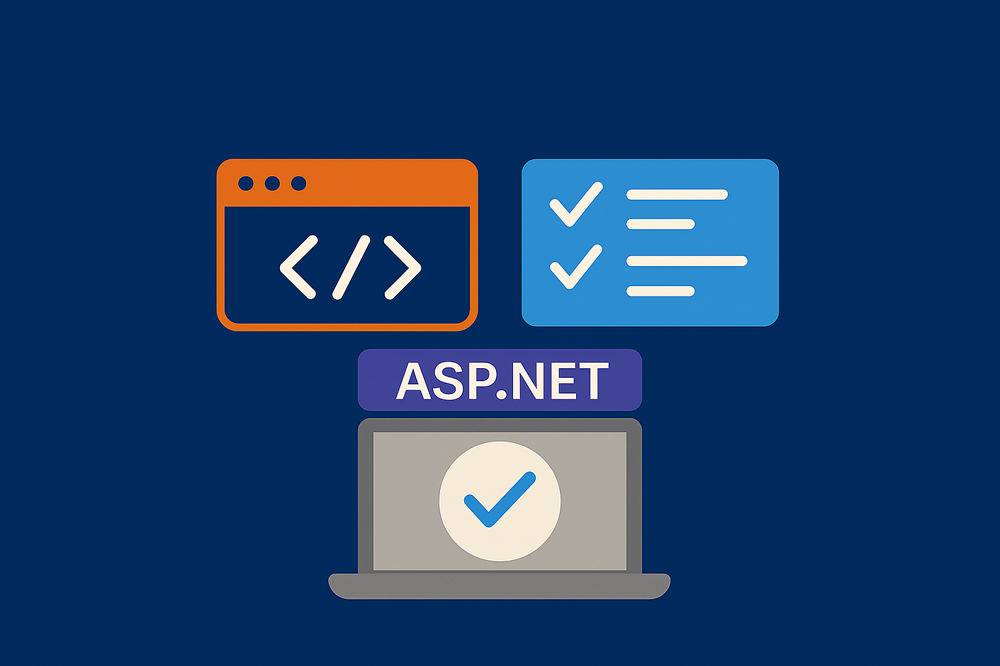

# testing minimal web apis with asp.net

Testing Web APIs doesn’t need to be a chore. No sprawling frameworks. No over-engineered test setups. Just sharp, focused integration tests that give you confidence.

Let’s build them.

## set up a minimal API worth testing ️

Forget databases. Forget layers of abstraction. You’re staring at a minimal book inventory API that lives entirely in memory. It’s lean. Perfect for test-driving.

Run this in your terminal:

```bash
dotnet new sln --name BooksInventory

mkdir src tests
dotnet new web -o src/BooksInventory.WebApi
dotnet new xunit -o tests/BooksInventory.WebApi.Tests

dotnet sln add src/BooksInventory.WebApi
dotnet sln add tests/BooksInventory.WebApi.Tests

dotnet add tests/BooksInventory.WebApi.Tests package FluentAssertions
dotnet add tests/BooksInventory.WebApi.Tests package Microsoft.AspNetCore.Mvc.Testing
```

## know what you’re testing

This API does two things. That’s it:

- **POST `/addBook`** — accepts a title, author, and ISBN; returns a new `BookId`.
- **GET `/books/{id}`** — returns the book’s details, or a 404 if it doesn’t exist.

Here’s the entire API, no fluff:

```csharp
using System.Collections.Concurrent;

var builder = WebApplication.CreateBuilder(args);
var app = builder.Build();

var books = new ConcurrentDictionary<string, Book>();

app.MapPost("/addBook", (AddBookRequest request) =>
{
    var bookId = Guid.NewGuid().ToString();
    var book = new Book(request.Title, request.Author, request.ISBN);

    if (!books.TryAdd(bookId, book))
    {
        return Results.Problem("Failed to add book due to a concurrency issue.");
    }

    return Results.Ok(new AddBookResponse(bookId));
});

app.MapGet("/books/{id}", (string id) =>
{
    if (books.TryGetValue(id, out var book))
    {
        return Results.Ok(book);
    }
    return Results.NotFound(new { Message = "Book not found", BookId = id });
});

app.Run();

public record AddBookRequest(string Title, string Author, string ISBN);
public record AddBookResponse(string BookId);
public record Book(string Title, string Author, string ISBN);

// Make Program partial for test visibility
public partial class Program { }
```

## write integration tests that matter

You're not mocking. You're not faking. You’re hitting the real thing using `WebApplicationFactory`.

```csharp
using FluentAssertions;
using Microsoft.AspNetCore.Mvc.Testing;

namespace BooksInventory.WebApi.Tests;

public class BookInventoryTests : IClassFixture<WebApplicationFactory<Program>>
{
    private readonly HttpClient _client;

    public BookInventoryTests(WebApplicationFactory<Program> factory)
    {
        _client = factory.CreateClient();
    }

    [Fact]
    public async Task AddBook_ReturnsBookId()
    {
        var request = new AddBookRequest("AI Engineering", "Chip Huyen", "1098166302");
        var content = request.GetHttpContent();

        var response = await _client.PostAsync("/addBook", content);

        response.EnsureSuccessStatusCode();
        var result = await response.DeserializeAsync<AddBookResponse>();
        result?.Should().NotBeNull();
        result!.BookId.Should().NotBeNullOrEmpty();
    }

    [Fact]
    public async Task GetBook_ReturnsBookDetails()
    {
        var addRequest = new AddBookRequest("AI Engineering", "Chip Huyen", "1234567890");
        var addResponse = await _client.PostAsync("/addBook", addRequest.GetHttpContent());
        var bookId = (await addResponse.DeserializeAsync<AddBookResponse>())?.BookId;

        var getResponse = await _client.GetAsync($"/books/{bookId}");

        getResponse.EnsureSuccessStatusCode();
        var book = await getResponse.DeserializeAsync<Book>();
        book.Should().BeEquivalentTo(
            new Book(
                addRequest.Title,
                addRequest.Author,
                addRequest.ISBN));
    }
}
```

## kill boilerplate with sharp extensions

Don't repeat yourself. Don’t clutter tests with serialization logic. Add these extensions and move on.

```csharp
using System.Text;
using System.Text.Json;

public static class HttpContentExtensions
{
    private static readonly JsonSerializerOptions SerializerOptions = new()
    {
        PropertyNameCaseInsensitive = true
    };

    public static async Task<T?> DeserializeAsync<T>(this HttpResponseMessage response)
    {
        return JsonSerializer.Deserialize<T>(
            await response.Content.ReadAsStringAsync(),
            SerializerOptions);
    }

    public static HttpContent GetHttpContent<T>(this T obj) where T : class
    {
        return new StringContent(
            JsonSerializer.Serialize(obj),
            Encoding.UTF8, "application/json");
    }
}
```

## skip the tests? hit it with rest client

Not every check needs a test method. Sometimes you just want to click. The **REST Client** extension in VS Code makes that painless.

Create a `.http` file like this:

```http
POST {{baseUrl}}/addBook HTTP/1.1
Content-Type: application/json

{
    "Title": "The Pragmatic Programmer",
    "Author": "Andy Hunt and Dave Thomas",
    "ISBN": "9780135957059"
}

###

# test GET /books/{id} (replace {id} with an actual ID)
GET {{baseUrl}}/books/{id} HTTP/1.1
Accept: application/json
```

No Postman. No curl. Just fire and read. Right in your editor.

## integration testing should feel like a power move

You don’t need a test framework war chest to validate your minimal API.

You need:

- Real HTTP calls through `WebApplicationFactory`
- Clean assertions from `FluentAssertions`
- A few smart helpers to keep your test files tight
- The REST Client for fast manual pokes when you feel like it

That’s it. Want to see the full source or send improvements? It’s on GitHub [right here](https://github.com/dorinandreidragan/books-inventory/tree/episode/01-testing-minimal-web-api). Go break something. Then test it better.
