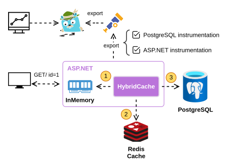

# if you can’t observe it 🔭, you can’t operate it

This is episode 4 of [A Hands-On Guide to Modern Software Development] series.

Modern applications are like living systems — always running, always changing. And if you can't see what’s happening inside them, you're flying blind.

In this episode, we’ll integrate **OpenTelemetry** with our ASP.NET minimal API and trace everything from database calls to cache hits — all visualized in **Jaeger**. We’ll also learn how to spot inefficiencies, validate cache behavior, and instrument our code for insights.

## why observability?

Here’s why:

- **Traces** help you understand how requests flow across services (and through layers like DB, cache, etc.).
- **Metrics** provide high-level health signals like request rates and error counts.
- **Logs** give you contextual breadcrumbs when something breaks.

In this episode, we’ll focus on **distributed tracing** using **OpenTelemetry + Jaeger**.

## why OpenTelemetry

- **Standardized**: One format for traces, metrics, and logs.
- **Vendor-neutral**: Export to Jaeger, Prometheus, and others.
- **Well-supported**: Actively developed, .NET-friendly.
- **Instrument once**: Works across libraries and runtimes.

## our goal

We want to evolve our architecture from this:

![Architecture before telemetry]

To this:

![Architecture with telemetry]

The key additions:

- **OpenTelemetry SDK**: Adds instrumentation to our app.
- **OpenTelemetry Collector**: Gathers telemetry and forwards it to backends.
- **Jaeger**: Visualizes trace data in a web UI.

## step-by-step setup

Let’s break this down:

### 1. Configure OpenTelemetry Collector

Create `src/telemetry/otel-collector.yml`:

```yaml
receivers:
  otlp:
    protocols:
      grpc:
        endpoint: otel-collector:4317
      http:
        endpoint: otel-collector:4318

exporters:
  otlp:
    endpoint: "jaeger:4317"
    tls:
      insecure: true

processors:
  batch:

service:
  pipelines:
    traces:
      receivers: [otlp]
      processors: [batch]
      exporters: [otlp]
```

This sets up an OTLP pipeline to receive traces and forward them to Jaeger:

- `otel-collector`: Container name used for internal Docker networking.
- `jaeger`: Same — used as hostname inside the Docker network.
- `tls.insecure: true`: Disables TLS checks (safe for local development).

### 2. Update `docker-compose.yml`

Add two new services:

```yaml
jaeger:
  image: jaegertracing/jaeger:2.5.0
  container_name: jaeger
  ports:
    - "16686:16686" # Jaeger UI

otel-collector:
  image: ghcr.io/open-telemetry/opentelemetry-collector-releases/opentelemetry-collector-contrib:0.125.0
  container_name: otel_collector
  command: ["--config=/etc/otel-collector.yml"]
  volumes:
    - ./src/telemetry/otel-collector.yml:/etc/otel-collector.yml
  ports:
    - "4317:4317"
  depends_on:
    jaeger:
      condition: service_started
```

Then run:

```bash
docker-compose up -d
```

Explanations:

- `otel-collector`: Reads config from the mounted file and listens on port `4317` for OTLP traces from the web API.
- `jaeger`: Exposes port `16686` so you can access the Jaeger UI at `localhost`.
- Both services are added to Docker Compose for easy local setup.

## Instrument the API with OpenTelemetry

These packages need to be added to the **BooksInventory.WebApi** project:

```bash
dotnet add package OpenTelemetry.Extensions.Hosting --version 1.12.0
dotnet add package OpenTelemetry.Instrumentation.AspNetCore --version 1.12.0
dotnet add package Npgsql.OpenTelemetry --version 9.0.3

dotnet add package OpenTelemetry.Instrumentation.Console --version 1.12.0
dotnet add package OpenTelemetry.Instrumentation.OpenTelemetryProtocol --version 1.12.0
```

Now modify `Program.cs`:

```csharp
// after service registrations

var service = ResourceBuilder
    .CreateDefault()
    .AddService("BooksInventory.WebApi")
    .AddAttributes(
    [
        new("service.name", "BooksInventory.WebApi"),
        new("service.namespace", "BooksInventory.WebApi"),
    ]);

builder.Services.AddOpenTelemetry()
    .WithTracing(tracing => tracing
        .SetResourceBuilder(service)
        .AddAspNetCoreInstrumentation()
        .AddNpgsql()
        .AddOtlpExporter()
        .AddConsoleExporter());

// before this code
var app = builder.Build();
```

Let’s break it down:

- We define a **resource** named `"BooksInventory.WebApi"` to identify this service in trace backends like Jaeger. It adds context to the spans so we know who sent them.
- `AddAspNetCoreInstrumentation()` captures HTTP request pipeline spans — giving visibility into endpoints, latency, and status codes.
- `AddNpgsql()` captures PostgreSQL commands (SQL queries, connection details) to understand database usage.
- `AddOtlpExporter()` sends traces to the collector via OTLP protocol.
- `AddConsoleExporter()` logs traces to the console — helpful for local debugging.

After starting the containers, initialize the database and start the web API:

```bash
dotnet ef database update --project src/BooksInventory.WebApi/BooksInventory.WebApi.csproj
dotnet run --project src/BooksInventory.WebApi/BooksInventory.WebApi.csproj
```

✅ Tip: Run the app and make a request to see traces printed in the console. This helps you verify instrumentation before wiring up Jaeger.

```bash
# ------------------------------------
# Span from PostgreSQL instrumentation
# ------------------------------------
Activity.TraceId:            a867a3ea03726e71f6fe56b1e8a421d1
Activity.SpanId:             103bacdf7a8e1da0
Activity.Tags:
    db.statement: INSERT INTO "Books" ("Author", "ISBN", "Title")
VALUES (@p0, @p1, @p2)
RETURNING "Id";
    db.system: postgresql
    db.connection_string: Host=localhost;Port=5432;Database=books_inventory;Username=user
    db.user: user
    db.name: books_inventory

# ------------------------------------
# Span from AspNetCore instrumentation
# ------------------------------------
Activity.TraceId:            a867a3ea03726e71f6fe56b1e8a421d1
Activity.SpanId:             1e5c7b4469f16e70
Activity.Tags:
    server.address: localhost
    server.port: 5000
    http.request.method: POST
    url.scheme: http
    url.path: /addBook
```

This proves that tracing is working — we see both HTTP-level and database-level spans captured and logged.

## Visualize Traces in Jaeger

Visit <http://localhost:16686> — you’ll land on the Jaeger UI. Once traces are generated, you can inspect them using Jaeger’s UI. Below is an example of how it looks in action:

![jaeger-in-action]

Try the following operations using the vscode REST client (see `BooksInventory.http` file):

1. Add a book via `/addBook`.

   ![add-book-span]

   - **POST `/addBook`** creates a new book and hits the DB.

2. Fetch it via `/books/{id}`.

   ![get-book-first-span]

   - **GET `/books/{id}`** (first time) results in a cache miss and hits the DB.

3. Fetch it again.

   ![get-book-second-span]

   - **GET `/books/{id}`** (second time) hits the cache — much faster (no hit on the DB this time).

## Debugging with Tracing: Real-World Benefits

### ⚠️ Found: Inefficient DELETE

Jaeger reveals that our DELETE endpoint was doing **two DB round-trips**:

![delete-book-span]

Looking at the code for delete in `Program.cs`:

```csharp
app.MapDelete("/books/{id}", async (int id, BooksInventoryDbContext db, HybridCache cache) =>
{
    // SELECT: 1st roundtrip to db.
    var book = await db.Books.FindAsync(id);
    if (book is null)
    {
        return Results.NotFound(new { Message = "Book not found", BookId = id });
    }

    // DELETE: 2nd roundtrip to db.
    db.Books.Remove(book);
    await db.SaveChangesAsync();

    // Remove the entry from the cache.
    await cache.RemoveAsync($"book_{id}");

    return Results.NoContent();
});
```

👉 We can do better:

```csharp
app.MapDelete("/books/{id}", async (int id, BooksInventoryDbContext db, HybridCache cache) =>
{
    // DELETE: only one roundtrip to db.
    var rowsAffected = await db.Books
        .Where(b => b.Id == id)
        .ExecuteDeleteAsync();

    if (rowsAffected == 0)
    {
        return Results.NotFound(new { Message = "Book not found", BookId = id });
    }

    // Remove the entry from the cache.
    await cache.RemoveAsync($"book_{id}");

    return Results.NoContent();
});
```

Let's now look at the trace:

![delete-book-optimized-span]

Yeap! Only one call to the database. Nice!

## Bonus: Cache Behavior Verification with Redis CLI

Want to confirm your cache is working?

Check Redis keys after a `GET` request:

```bash
docker exec -it redis redis-cli KEYS "*"
```

```bash
1) "BooksInventoryCache:book_3"
2) "BooksInventoryCache:book_2"
```

Watch Redis keyspace notifications in real-time:

```bash
# Enable keyspace notifications
docker exec -it redis redis-cli CONFIG SET notify-keyspace-events KEA

# Subscribe to a key's activity
docker exec -it redis redis-cli PSUBSCRIBE "__keyspace@0__:BooksInventoryCache:book_3"
```

You’ll first see an output like this — it confirms that you're now listening to changes on a key (e.g. `PUT`, `DELETE`):

```bash
Reading messages... (press Ctrl-C to quit)
1) "psubscribe"
2) "__keyspace@0__:BooksInventoryCache:book_3"
3) (integer) 1
```

Now trigger a `PUT` or `DELETE`, and you’ll see events like:

```bash
1) "pmessage"
2) "__keyspace@0__:BooksInventoryCache:book_3"
3) "__keyspace@0__:BooksInventoryCache:book_3"
4) "hset"
1) "pmessage"
2) "__keyspace@0__:BooksInventoryCache:book_3"
3) "__keyspace@0__:BooksInventoryCache:book_3"
4) "expire"
```

This confirms your cache is being updated live — and gives you deep visibility into cache dynamics.

## **Beyond Traces: Expanding Observability**

This episode focused on **tracing**, but observability extends far beyond that. To fully understand and optimize a system, we need to monitor key signals:

| Signal       | Backend    | Purpose                                |
| ------------ | ---------- | -------------------------------------- |
| **Traces**   | Jaeger     | Understand request flow & latency      |
| **Metrics**  | Prometheus | Monitor service health and performance |
| **Logs**     | OpenSearch | Debug context for incidents            |
| **🔭 Views** | Grafana    | Unified observability dashboard        |

With **tracing in place**, it’s time to level up:

### **What’s Next?**

1. **Enhancing HybridCache**
   HybridCache doesn't have native OpenTelemetry instrumentation yet—can we extend it for better traceability?

2. **Exploring FusionCache**
   FusionCache provides a **drop-in HybridCache implementation** with built-in OpenTelemetry support. Want to see it in action?

3. **Adding Metrics & Logs**

   - Metrics: Integrate **Prometheus** for performance monitoring.
   - Logs: Wire up **OpenSearch** for structured logging.
   - Unified observability? Enter **Grafana**.

4. **Handling Race Conditions**
   Distributed consistency bugs are tricky.

   - What happens if the cache and DB go out of sync under heavy load?
   - How can **Locust** load tests + traces expose race conditions?

5. **Observability in Tests**
   - How do we verify tracing **inside integration tests**?
   - Can **Testcontainers** + OpenTelemetry give us insights during testing?

Observability is **not just about seeing—but about understanding**.

If You Can’t Observe It 🔭, You Can’t Operate It.
Check out the full code and episodes in the [GitHub repository].

[Architecture before telemetry]: ../../.assets/books-inventory/architecture-caching.svg
[Architecture with telemetry]: ../../.assets/books-inventory/architecture-caching-telemetry.svg
[jaeger-in-action]: ../../.assets/books-inventory/jaeger-in-action.gif
[add-book-span]: ../../.assets/books-inventory/add-book-span.png
[get-book-first-span]: ../../.assets/books-inventory/get-book-first-span.png
[get-book-second-span]: ../../.assets/books-inventory/get-book-second-span.png
[delete-book-span]: ../../.assets/books-inventory/delete-book-span.png
[delete-book-optimized-span]: ../../.assets/books-inventory/delete-book-optimized-span.png
[GitHub repository]: https://github.com/dorinandreidragan/books-inventory
