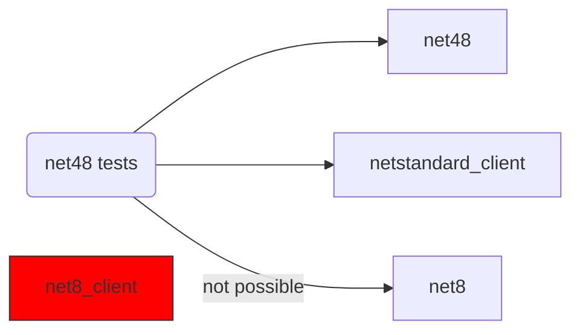
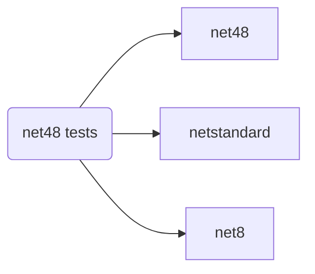
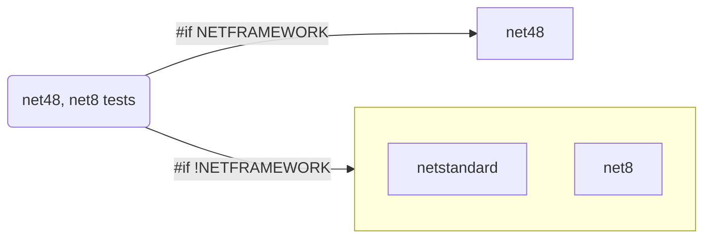

# target different .net versions in test projects

This document explains how to target different .Net versions in test projects.
It mainly focuses on the `net48` and `net8` frameworks.

## net48 test projects

The `net48` test projects **cannot** reference `net8` class libraries. The only
way to do that, would be to convert the old project format to
`Microsoft.Net.Sdk` format and target multiple frameworks. See [Multi Target
Test Projects](#multi-target-tests-projects).



## net8 test projects

The `net8` test projects **can** reference `net48`, `netstandard` and `net8`
class libraries without any other adjustments.



## multi-target test projects

A project that has the `Microsoft.Net.Sdk` format for its `*.csproj` file can
target multiple frameworks. In the diagram and code snippets below, it is
illustrated how we can multi-target `net481` and `net8.0`.



- Change the `*.csproj` as below in order to target `net8.0` and `net481`
  frameworks.

```xml
<!-- *.csproj -->
<PropertyGroup>
  <TargetFrameworks>net8.0;net481</TargetFrameworks>
</PropertyGroup>

...

<!-- conditionaly target the net481 project -->
<ItemGroup Condition=" '$(TargetFramework)' == 'net481'">
  <ProjectReference Include="..\Net48Client\Net48Client.csproj" />
</ItemGroup>

<!-- conditionaly target the net8.0 project -->
<ItemGroup Condition=" '$(TargetFramework)' == 'net8.0'">
  <ProjectReference Include="..\Net8Client\Net8Client.csproj" />
</ItemGroup>
```

- Change the unit tests classes as below in order to run the corresponding code
  for the targeted framework, considering this:
  - The `using` statement **needs** compiler directive
  - The `netstandard` code **does not need** any compiler directive
  - The `net481` and `net8` code **needs** compiler directive

```cs
// The using section needs directives
#if !NETFRAMEWORK
using Net8Client;
#else
using Net48Client;
#endif

namespace NetMultiTargetTests;

[TestClass]
public class NetCalculatorTests
{
    // Method that runs with netstandard doesn't need any directive
    [TestMethod]
    public void NetStandard20SumTest()
    {
        Assert.AreEqual(3, new NetStandard20Calculator().Sum(1, 2));
    }


// Methods that run with net8 needs directive
#if !NETFRAMEWORK

    [TestMethod]
    public void Net8SumTest()
    {
        Assert.AreEqual(3, new Net8Calculator().Sum(1, 2));
    }

// Methods that run with net48 needs directive
#else

    [TestMethod]
    public void Net48SumTest()
    {
        Assert.AreEqual(3, new Net48Calculator().Sum(1, 2));
    }


#endif
}
```
